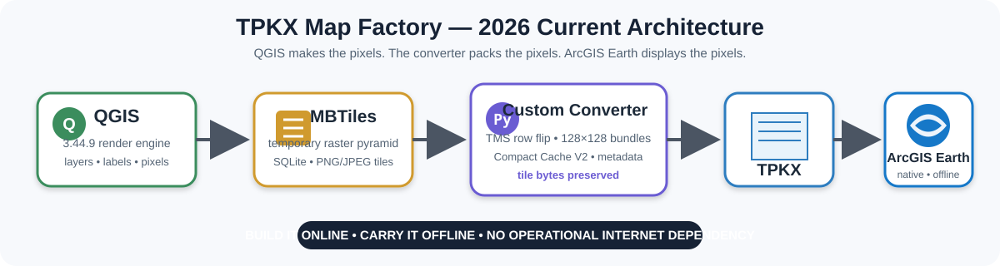

# Offline GeoStack

## QGIS → TPKX → ArcGIS Earth + Live Field Positioning

**A Windows-first offline geospatial stack for manufacturing native TPKX maps, running them in ArcGIS Earth, and feeding live GNSS / PRAVE / F22 / QR field data without depending on the Internet at showtime.**



This repository began life as the **Google Maps Dispatch System**. That lineage is preserved, but the 2026 architecture has outgrown the old name.

**Offline GeoStack** is the master project identity.

> **QGIS makes the pixels. The converter packs the pixels. ArcGIS Earth displays the pixels.**

> **Build it online. Carry it offline.**

---

## Status at a glance

| Subsystem | Status |
| --- | --- |
| TPKX Map Factory v1.0.0 | ✅ **RELEASE-ACCEPTED** |
| QGIS → MBTiles manufacturing | ✅ **LIVE-PROVEN** |
| MBTiles → TPKX / Compact Cache V2 converter | ✅ **LIVE-PROVEN** |
| Advanced existing-MBTiles conversion | ✅ **LIVE-PROVEN** |
| ArcGIS Earth native TPKX runtime | ✅ **LIVE-PROVEN** |
| PRAVE → ArcGIS Earth Automation API | ✅ **LIVE-PROVEN** |
| AE session restoration of loaded TPKX | ✅ **LIVE-OBSERVED** |
| Native AE GNSS with actual field receiver | ⏳ **FIELD ACCEPTANCE PENDING** |
| Operational Internet dependency | **NONE BY DESIGN** |

---

## Start here

- **[TPKX Map Factory v1.0.0 release record](releases/README.md)**
- **[Required QGIS project files](required_qgis_projects/)**
- **[Quick Start](docs/QUICK_START.md)**
- **[Professional GIS Engineering Record](docs/professional_report/README.md)**
- **[Technical Architecture](docs/TECHNICAL_ARCHITECTURE.md)**
- **[PRAVE → ArcGIS Earth live integration](docs/PRAVE_ARCGIS_EARTH_INTEGRATION.md)**
- **[Offline doctrine / Persistent Geographic Context](docs/OFFLINE_OPERATION_AND_PERSISTENT_GEOGRAPHIC_CONTEXT.md)**

The exact release-accepted Windows archive is named `TPKX_MAP_FACTORY_v1_0_0.zip`. It remains preserved in the project’s canonical working archive. A connector-truncated GitHub copy was deliberately removed rather than leaving a bad public download; the exact binary should be attached directly to GitHub before public release distribution.

---

## What the stack actually does

```text
Map source / QGIS layer stack
          ↓
QGIS 3.44.9 raster rendering
          ↓
Temporary raster MBTiles
          ↓
Custom MBTiles → TPKX converter
(Esri Compact Cache V2)
          ↓
Native .tpkx package
          ↓
ArcGIS Earth
          ↓
GNSS / PRAVE / F22 / QR / KML field inputs
```

The normal user does not need to operate QGIS manually, understand SQLite, learn Compact Cache V2, or own ArcGIS Pro. The finished map is one `.tpkx` file that ArcGIS Earth opens natively.

The advanced user can bypass the canned map-source workflow and feed an existing raster MBTiles directly into the same converter engine.

---

## Why this exists

Two mature GIS worlds were already almost touching:

- **QGIS** could render sophisticated cartography and generate raster MBTiles.
- **ArcGIS Earth** could consume native TPKX packages beautifully, including offline.

The missing bridge for this workflow was:

```text
raster MBTiles → Esri Compact Cache V2 / TPKX
```

That bridge now exists.

The converter does **not** rerender the cartography. It reads the already-rendered raster tile bytes, converts the addressing/container structure, writes Compact Cache V2 bundles and TPKX metadata, and packages the result.

That separation is the point:

- QGIS owns projection, layer composition, labels, symbols, blending, and cartography.
- MBTiles carries the temporary raster pyramid.
- The converter owns deterministic indexing, bundle layout, metadata, and packaging.
- ArcGIS Earth owns runtime display and navigation.

A GIS professional can therefore build parcels, contours, labels, roads, utilities, local imagery, historical scans, forestry layers, or other suitable rasterized layer stacks in QGIS and carry the finished pixels into ArcGIS Earth through the advanced converter path.

---

## TPKX Map Factory v1.0.0

**Status: LIVE-PROVEN / RELEASE-ACCEPTED — 2026-08-15**

### Normal-user workflow

```text
1. Choose map source
2. Choose map area
3. Choose zoom range
4. BUILD TPKX MAP
5. Open the finished .tpkx in ArcGIS Earth
```

The v1.0.0 GUI exposes four frozen map choices:

1. **Google Earth**
2. **Google Hybrid**
3. **Esri World**
4. **Esri World / Google Labels**

Frozen raster recipe:

- QGIS **3.44.9**
- Python **3.14.5** established known-good
- PNG raster tiles
- **96 DPI**
- antialiasing **ON**
- metatile **4**
- operator-selectable **Z0–Z20**
- temporary manufacturing format: **MBTiles**
- final operator deliverable: **one `.tpkx`**

### Advanced GIS workflow

The same GUI includes:

**ADVANCED: MBTILES → TPKX**

The beginner does not have to become a GIS operator. The GIS operator does not have to accept beginner limitations.

---

## The converter in one screenful

```text
MBTiles SQLite tiles
  zoom_level
  tile_column
  tile_row
  tile_data
        ↓
TMS row → ArcGIS top-origin row
        ↓
128 × 128 Compact Cache V2 bundle addressing
        ↓
.bundle binary records + indexes
        ↓
root.json + iteminfo.json + thumbnail
        ↓
ZIP64 .tpkx
```

Critical TMS row conversion:

```text
y_arcgis = (2^z - 1) - y_tms
```

Tile placement and bundle indexing are deterministic. The raster tile bytes produced by QGIS are preserved rather than resampled into a new cartographic pyramid.

The result is not a screenshot and not a flattened poster. It is a real multi-zoom native TPKX package.

---

## Live acceptance evidence

### First integrated Factory proof

- Source: Google Hybrid
- Area: 113.31 sq mi
- Zooms: Z8–Z18
- Tiles: 23,119
- Windows File Explorer size: **3,560,735 KB**
- Elapsed: **0:13:55**
- ArcGIS Earth: **PASS**

### Large advanced MBTiles → TPKX proof

- Existing raster MBTiles supplied directly to the advanced path
- Tiles: **271,497**
- Bundles: **47**
- Zooms: Z8–Z18
- Windows File Explorer size: **25,561,426 KB**
- Elapsed: **0:17:59**
- ArcGIS Earth: **PASS**

### Large Esri World / Google Labels Factory proof

- Area: approximately 1,378.89 sq mi
- Tiles: **271,242**
- Zooms: Z8–Z18
- Windows File Explorer size: **24,291,406 KB**
- Elapsed: **2:51:52**
- ArcGIS Earth: **PASS**

### v1.0.0 release smoke test

- Map area entered from two manual decimal-degree GPS diagonal points
- Factory normalized the corners and produced the EPSG:3857 HOME EXTENT
- Area: approximately 0.12 sq mi
- Output: `test2 small.tpkx`
- Windows-visible output size: **12,852 KB**
- Elapsed: **0:00:12**
- ArcGIS Earth: **PASS**

For this project, **ArcGIS Earth is the final operational acceptance authority** for finished TPKX output.

---

## ArcGIS Earth runtime

ArcGIS Earth is the current primary 3D operational viewer.

Relevant capabilities observed or proven in this project include:

- native local TPKX display
- KML/KMZ support
- KML NetworkLinks
- 3D globe navigation
- native GNSS/NMEA capability
- local Automation API
- native drawing / marker display
- session restoration of previously loaded TPKX files
- online point-to-point driving directions when connectivity exists

Online services are enhancements, not dependencies.

---

## No operational Internet dependency

> **There can be no operational dependence on Internet connectivity. Period.**

Internet access can be used while preparing or refreshing maps. At incident/showtime, core operation must continue without a hotspot, without cellular coverage, and without a live map service.

```text
manufacture the geographic environment beforehand
        ↓
carry the TPKX locally
        ↓
open AE
        ↓
operate even if the network disappears
```

The map is already in the trunk.

The project uses **Persistent Geographic Context** for the operating condition in which position, surroundings, routes, and terrain remain continuously visible without having to summon them from a network.

---

## Live positioning and field inputs

Offline GeoStack is not only a map factory.

The `$PRAVE` decoder has a **LIVE-PROVEN ArcGIS Earth Automation API path**. Controlled traffic displayed units `7-101` through `7-106` as native ArcGIS Earth drawings using the established fire-truck RSSI icon family.

Observed healthy test state included:

```text
UNITS=6
API_OK=47
API_BAD=0
BAD_RMC=0
BAD_PRAVE=0
RMC=FRESH
```

Forward inputs include:

- `$PRAVE`
- F22
- native GNSS / NMEA
- QR dispatch / bounded command input
- KML/KMZ / NetworkLinks where interoperability makes KML the correct tool

KML remains first-class. It simply no longer has to carry jobs that native TPKX or the Automation API can do better.

---

## Required QGIS projects

The current reference projects are included in [`required_qgis_projects/`](required_qgis_projects/):

- `REQUIRED_FACTORY_PROJECT_DO_NOT_EDIT.qgz`
- `ESRI and Google Labels.qgz`

Install location:

```text
C:\Google Earth Project\QGIS\
```

The project uses read-only reference files plus archive recovery rather than a hash-gate workflow.

---

## Repository map

- `README.md` — public front door
- `docs/README.md` — documentation index and architecture diagram
- `docs/TECHNICAL_ARCHITECTURE.md` — detailed converter / pipeline engineering
- `docs/professional_report/` — long-form professional GIS and future-AI record
- `docs/PRAVE_ARCGIS_EARTH_INTEGRATION.md` — live positioning path
- `docs/OFFLINE_OPERATION_AND_PERSISTENT_GEOGRAPHIC_CONTEXT.md` — offline doctrine
- `docs/AI_ENGINEERING_METHOD.md` — human/AI development method
- `CHANGELOG.md` — release and architecture evolution
- `CONTRIBUTING.md` — acceptance and do-not-regress rules
- `required_qgis_projects/` — the two current QGIS reference projects
- `releases/` — release notes, checklist, lineage, and binary-release status
- `docs/legacy/` + legacy README — preserved Google Earth lineage

---

## Licensing and source-data boundary

Original Offline GeoStack software and documentation are published under the **MIT License** unless a file states otherwise.

That does **not** grant rights to third-party imagery, labels, basemaps, vendor software, or external services. Map-source licensing, caching, export, attribution, and redistribution rules remain source-specific. See [`NOTICE.md`](NOTICE.md) and [`docs/SOURCE_AND_LICENSING_NOTE.md`](docs/SOURCE_AND_LICENSING_NOTE.md).

---

## Authorship and AI collaboration

The project is developed and published by **Jim Gaddy** with **ChatGPT / Tool Master** serving as technical design, coding, GIS research, documentation, packaging, and diagnostic partner.

The MBTiles → TPKX bridge illustrates why AI changes the cost of this kind of engineering. The underlying formats and mathematics already existed. The 2026 difference is the ability to hold SQLite/MBTiles, Web Mercator tile math, TMS addressing, binary file structures, Compact Cache V2, Python implementation, QGIS rendering, Windows behavior, and ArcGIS Earth acceptance behavior in one working context and rapidly build the missing glue.

---

# Offline GeoStack

**QGIS → TPKX → ArcGIS Earth + Live Field Positioning**

> **It is not the number of bytes that matters. It is what the bytes are doing.**
