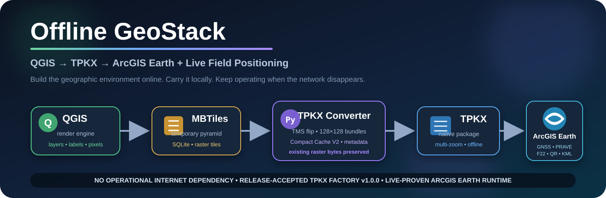

# Offline GeoStack Documentation



Current architecture:

**QGIS → native MBTiles / TPKX products → router-only Map Fountain → ArcGIS Earth → live field-position inputs.**

Canonical system drawing:

**[Factory / PC / Android router-only flowchart](https://github.com/Jim-dc95811/Map-Fountain/blob/main/docs/arcgis_system_router_flowchart_2026-08-17.svg)**

Do not revive the older local `current_architecture.svg` / USB-WMTS diagram as current truth.

## Current state

### Windows field map path — LIVE-PROVEN

```text
native TPKX on USB SSD
→ GL.iNet Flint 2
→ Samba / SMB
→ private Wi-Fi or Ethernet
→ ArcGIS Earth Windows
```

### Android router path — NEXT ACCEPTANCE GATE

```text
router-attached SSD
→ private Wi-Fi
→ ArcGIS Earth Mobile
```

The client must decide the simplest compatible consumption path. Do not assume the historical Windows WMTS service needs to return.

## Start here

- **[Offline GeoStack README](../README.md)** — current public architecture and status.
- **[Map Fountain](https://github.com/Jim-dc95811/Map-Fountain)** — router-only acceptance record, benchmarks, evidence hashes, and Android next gate.
- **[Software & Downloads](SOFTWARE_AND_DOWNLOADS.md)** — pinned QGIS 3.44.9, Python 3.14.5, ArcGIS Earth, required QGIS projects, and release records.
- [Quick Start](QUICK_START.md) — normal-user and advanced-user operation for the frozen Factory baseline.
- [Professional GIS Engineering Record](professional_report/README.md) — long-form architecture, implementation, validation, operational doctrine, appendices, and future-AI continuity reference.
- [Technical Architecture](TECHNICAL_ARCHITECTURE.md) — Factory/converter/runtime engineering record.
- [Technical FAQ](FAQ.md) — direct answers for GIS developers.
- [Notes for GIS Professionals](NOTES_FOR_GIS_PROFESSIONALS.md) — condensed interoperability interpretation.
- [Offline Operation and Persistent Geographic Context](OFFLINE_OPERATION_AND_PERSISTENT_GEOGRAPHIC_CONTEXT.md) — offline doctrine.
- [PRAVE → ArcGIS Earth Integration](PRAVE_ARCGIS_EARTH_INTEGRATION.md) — live-proven Automation API path and RSSI display rules.
- [AI-Assisted Engineering Method](AI_ENGINEERING_METHOD.md) — human/AI closed-loop method.
- [AI Continuity / Restart Note](AI_CONTINUITY_RESTART_NOTE.md) — current baseline and do-not-regress rules.
- [Historical Timeline](HISTORICAL_TIMELINE.md) — project lineage.
- [Source and Licensing Note](SOURCE_AND_LICENSING_NOTE.md) — technical capability versus source-data rights.
- [Roadmap](../ROADMAP.md) — Android-first current gate and later work.

## Historical mobile material

The following 2026-08-16 documents are retained as engineering lineage, not the current field architecture:

- `ARCGIS_EARTH_MOBILE_MAP_FOUNTAIN.md`
- `mobile_map_fountain_live_proof_2026-08-16.md`
- `PROJECT_STATUS_2026-08-16.md`

They record the Windows-hosted HTTPS WMTS → Android USB-tether proof that preceded the router-only breakthrough.

## Current deployment principle

```text
Factory makes native products
→ SSD stores them
→ router shares them
→ ArcGIS Earth consumes them
```

> **Keep the router dumb. Keep the maps native. Let ArcGIS Earth do the GIS work.**
